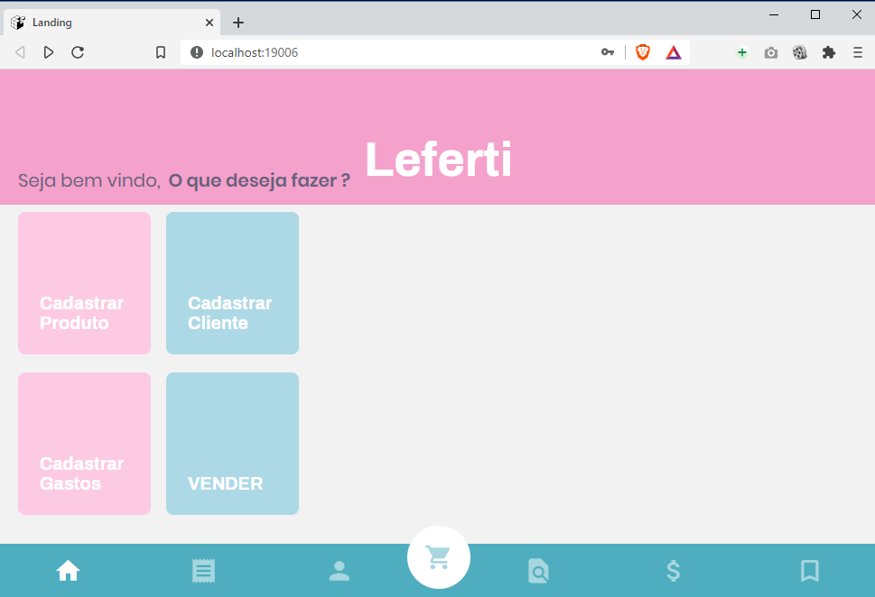
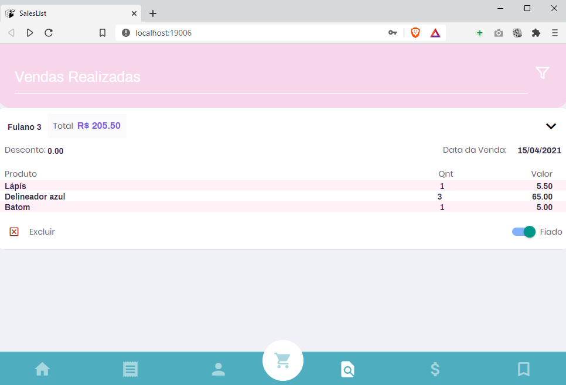
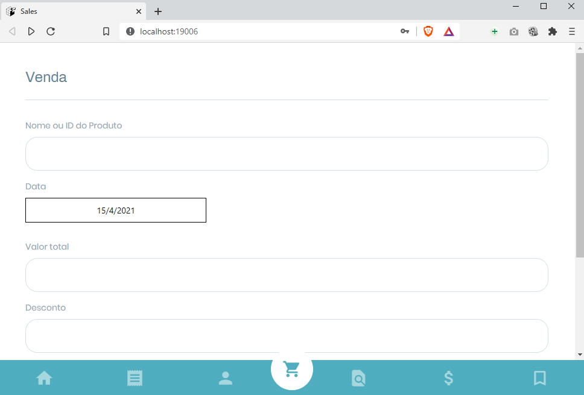

<h1 align="center">
    Controle de vendas
</h1>

<p align="center">
  <a href="#-tecnologias">Tecnologias</a>&nbsp;&nbsp;&nbsp;|&nbsp;&nbsp;&nbsp;
  <a href="#-projeto">Projeto</a>
</p>

<p align="center">
 

  
</p>

<br>

## 💻  Tecnologias

Para executar esse projeto, será necessário as tecnologias: 

- [Node](https://nodejs.org/en/download/)
- [Expo](https://docs.expo.io/get-started/installation/)

## 💻 Projeto

Após configurar o ambiente Node, e instalar a ferramenta Expo, 
Executar no diretório da aplicação:


```bash
> expo start
```

Com isso, a aplicação iniciará podendo ser conectada por qrCode utilizando: 

- [Expo Go](https://expo.io/client)

Ou poderá iniciar a versão Web, utilizando o comando:

```bash
> expo start --web
```

#### Tela Web Landing




#### Tela Vendas Realizadas




#### Tela Cadastro de vendas




 ## Licença

Esse projeto está sob a licença MIT. Veja o arquivo [LICENSE](LICENSE.md) para mais detalhes.

---

by agrarcanjo 
